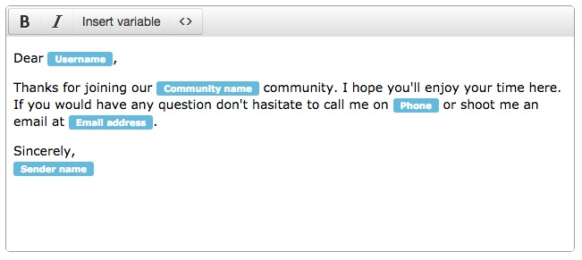

# TinyMCE variable [](https://circleci.com/gh/ambassify/tinymce-variable/tree/master)

TinyMCE variable is a plugin that makes it easier to work with variables in text.
A lot of web applications today allow users to write content with variables. Server side these variables can then be replaced with actual data.
There are many large companies that use this kind of functionality but a lot of these implementations are not very user friendly.

With this project we provide a user friendly implementation of such a feature nicely packaged as a TinyMCE plugin.



## Demo

[Demo example of this plugin](http://ambassify.github.io/tinymce-variable/)

## Features

* Replace variables like `{{example}}` with something more readable
* Variables are not editable
* Delete variables with one hit on the backspace button
* Custom class for variable elements
* Auto replace when typing a variable
* Custom variable prefix and suffix

## Example

```
tinymce.init({
    selector: "textarea",  // change this value according to your HTML
    plugins: "variable"
});
```

## Options
These settings affect the execution of the `variables` plugin. The settings described here will affect the visual appearance and the working of the `variables` plugin in the current editor instance.

### `variable_mapper`
This option makes it possible to provide a human readable variant of specific variables. If the variables plugin detects such a mapper it will use that value to display the variable in the editor. An example use case for this could be to localize variable names.

```
tinymce.init({
    selector: "textarea",
    plugins: "variable",
    variable_mapper: {
        account_id: "Account ID",
        email: "E-mail address"
    }
});
```

### `variable_valid`
This option makes it possible to provide a specific list of allowed variables, if the variable is not in the list then the plugin will not visualize it as such.

```
tinymce.init({
    selector: "textarea",
    plugins: "variable",
    variable_valid: ["username", "sender", "phone", "community_name", "email"]
});
```

### `variable_class`
By default each variable instance in the editor will have a class name `variable`. If you want to use a custom class name you can use this option to overwrite it.

```
tinymce.init({
    selector: "textarea",
    plugins: "variable",
    variable_class: "my-custom-variable"
});
```

### `variable_prefix` and `variable_suffix`
By default the prefix and suffix used are, the commonly used, double brackets (`{{` and `}}`). You can customize these if you prefer something else using these options.

```
tinymce.init({
    selector: "textarea",
    plugins: "variable",
    variable_prefix: ""
});
```

## Develop
To start a HTTP server to test your changes you can run following command and open the reported URL in your browser.

```
npm run serve
```

Make sure to run the tests before pushing code or submitting any pull request using:

```
npm run test
```

## Products using TinyMCE Variables
* [BuboBox](https://www.bubobox.com/?utm_source=github&utm_medium=readme&utm_campaign=tinymce-variable)
* [Ambassify](https://www.ambassify.com/?utm_source=github&utm_medium=readme&utm_campaign=tinymce-variable)

## Contributing

1. Fork it!
2. Create your feature branch: `git checkout -b my-new-feature`
3. Commit your changes: `git commit -m 'Add some feature'`
4. Push to the branch: `git push origin my-new-feature`
5. Submit a pull request :D

## History

For detailed changelog, check [Releases](https://github.com/ambassify/tinymce-variable/releases).

## License

[MIT License](http://opensource.org/licenses/MIT)
